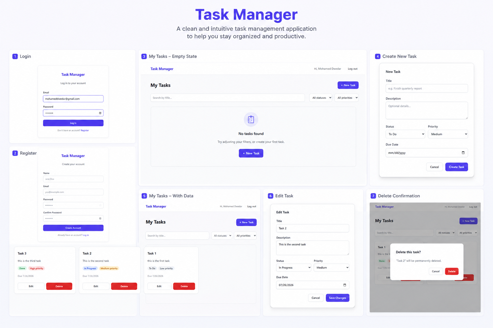

# Task Manager — MERN Stack Assessment

A full-stack task management application built with MongoDB, Express, React, and Node.js.




## Project Overview

Users can register, log in, and manage their own tasks (create, read, update, delete). Each task has a title, description, status (`To Do` / `In Progress` / `Done`), priority (`Low` / `Medium` / `High`), and an optional due date. Tasks can be searched by title and filtered by status/priority, with pagination and sorting. Authentication is JWT-based, and every task operation is scoped to the authenticated user — there is no way for one user to read, edit, or delete another user's tasks.

## Tech Stack

**Backend:** Node.js, Express, MongoDB, Mongoose, JWT, bcryptjs, express-validator, Helmet, express-rate-limit, express-mongo-sanitize, Winston, Jest + Supertest + mongodb-memory-server.

**Frontend:** React 18, React Router, Axios, TanStack React Query, React Hook Form, Tailwind CSS, react-hot-toast.

## Folder Structure

```
task-manager/
  backend/
    src/
      config/         env loading, logger, DB connection
      constants/       shared enums (task status/priority)
      controllers/     thin HTTP layer (parse request -> call service -> respond)
      errors/          AppError + typed subclasses (NotFoundError, etc.)
      helpers/         pure functions (e.g. query-string -> Mongo filter builder)
      middleware/      auth (JWT verify), error handler, rate limiter, 404
      models/          Mongoose schemas (User, Task)
      repositories/    the only layer that queries Mongoose directly
      routes/          Express routers
      services/        business logic, no req/res objects
      utils/           asyncHandler, apiResponse, jwt helpers
      validators/      express-validator chains
      app.js           Express app (no .listen — testable with supertest)
      server.js        connects DB, starts the HTTP server
    tests/
      unit/            pure-function tests, no DB required
      integration/      full HTTP request/response tests against an in-memory MongoDB
  frontend/
    src/
      api/             axios client + per-resource API functions
      components/      reusable UI pieces (Button, TaskForm, TaskCard, ...)
      context/         AuthContext (session state)
      hooks/           useAuth, and React Query hooks for tasks
      layouts/         AuthLayout, MainLayout
      pages/           LoginPage, RegisterPage, DashboardPage, NotFoundPage
      routes/          AppRoutes, ProtectedRoute, GuestRoute
      utils/           shared constants, error-message helper
  docker-compose.yml
```

## Architecture Decisions

- **Repository Pattern + Service Layer:** Controllers never touch Mongoose directly. Repositories are the only layer that runs queries; services hold business rules and depend on repositories, not on Mongoose models. This makes services testable by mocking the repository, and would make swapping databases a change isolated to the repository layer.
- **Centralized error handling:** Every layer throws typed errors (`NotFoundError`, `ValidationError`, etc.) extending a base `AppError` with an `isOperational` flag. One error-handling middleware at the bottom of the middleware stack formats every error response consistently and guarantees internal errors/stack traces never reach the client.
- **Ownership enforcement at the query level:** Every task repository method takes `userId` and folds it directly into the Mongo filter (`{ _id, owner: userId }`), rather than fetching a document and checking ownership afterward. A user requesting another user's task gets a 404 (not 403), so as not to leak whether the resource even exists.
- **`req.user.id` is the only source of truth for identity.** It's set once, by the `protect` middleware, after verifying the JWT and re-fetching the user from the database. No controller or service ever accepts a user id from `req.body` or `req.params`.

## Installation

Prerequisites: Node.js 18+, npm, and either a local MongoDB instance or a MongoDB Atlas connection string (or Docker, see below).

```bash
git clone <your-repo-url>
cd task-manager
```

### Backend

```bash
cd backend
cp .env.example .env    # then fill in MONGODB_URI and JWT_SECRET
npm install
npm run dev              # nodemon, http://localhost:5000
```

### Frontend

```bash
cd frontend
cp .env.example .env    # VITE_API_URL should point at the backend
npm install
npm run dev               # http://localhost:5173
```

### Running with Docker

```bash
docker compose up --build
```
This starts MongoDB, the backend (port 5000), and the frontend (served by nginx on port 5173).

## Environment Variables

**backend/.env**

| Variable | Description |
|---|---|
| `NODE_ENV` | `development` or `production` |
| `PORT` | Backend port (default 8000) |
| `MONGODB_URI` | MongoDB connection string |
| `JWT_SECRET` | Secret used to sign JWTs — must be a long random string in production |
| `JWT_EXPIRES_IN` | Token lifetime, e.g. `7d` |
| `CLIENT_URL` | Frontend origin, used for CORS |
| `AUTH_RATE_LIMIT_WINDOW_MS` / `AUTH_RATE_LIMIT_MAX` | Rate limiting window for `/api/auth/*` |

**frontend/.env**

| Variable | Description |
|---|---|
| `VITE_API_URL` | Base URL of the backend API, e.g. `http://localhost:8000/api` |

Neither `.env` file is committed — only the `.env.example` templates are.

## API Endpoints

| Method | Endpoint | Auth | Description |
|---|---|---|---|
| POST | `/api/auth/register` | No | Create an account, returns `{ user, token }` |
| POST | `/api/auth/login` | No | Log in, returns `{ user, token }` |
| POST | `/api/tasks` | Yes | Create a task |
| GET | `/api/tasks` | Yes | List the current user's tasks. Query params: `search`, `status`, `priority`, `page`, `limit`, `sortBy` (`createdAt`\|`dueDate`\|`priority`\|`title`), `order` (`asc`\|`desc`) |
| GET | `/api/tasks/:id` | Yes | Get a single task |
| PUT | `/api/tasks/:id` | Yes | Update a task (partial updates supported) |
| DELETE | `/api/tasks/:id` | Yes | Delete a task |
| GET | `/health` | No | Health check |

All authenticated endpoints expect `Authorization: Bearer <token>`.

Response shape (success): `{ success: true, message, data, meta? }`
Response shape (error): `{ success: false, message, errors? }`

## Authentication

JWTs are signed with `JWT_SECRET` and contain only `{ id: userId }`. Every protected route runs through the `protect` middleware, which verifies the token, re-fetches the user from the database, and sets `req.user.id`. Passwords are hashed with bcrypt (12 salt rounds) in a Mongoose pre-save hook, and the password field is excluded from all query results by default (`select: false`).

## Testing

```bash
cd backend
npm test
```

- `tests/unit/` — pure-function tests (query/pagination builder), no database needed.
- `tests/integration/` — full HTTP tests (register/login, task CRUD, cross-user ownership isolation) against an in-memory MongoDB via `mongodb-memory-server`. The first run downloads a MongoDB binary, so it needs normal internet access.

## Deployment Steps

1. Provision a MongoDB instance (MongoDB Atlas free tier is simplest).
2. Deploy `backend/` to a Node host (Render, Railway, Fly.io, etc.), setting the environment variables listed above.
3. Deploy `frontend/` as a static site (Vercel, Netlify) with `VITE_API_URL` pointing at the deployed backend, or serve it via the provided Dockerfile/nginx.
4. Update `CLIENT_URL` on the backend to match the deployed frontend origin (for CORS).

## Known Issues / Incomplete Items

- No refresh-token rotation — a single JWT is valid for its full lifetime (`JWT_EXPIRES_IN`). Acceptable for the scope of this assessment; a production app would add refresh tokens.
- No drag-and-drop between statuses (listed as an optional bonus, not implemented).
- No task attachments (optional bonus, not implemented).

## Future Improvements

- Refresh tokens / token rotation
- Optimistic UI updates for task mutations
- Drag-and-drop status changes on the dashboard
- Task attachments via signed upload URLs